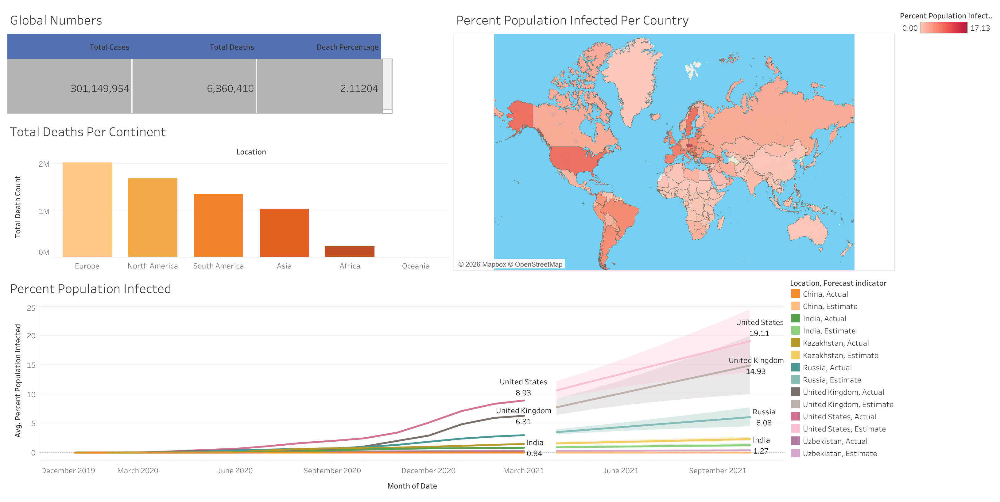

# COVID-19 Data Analysis
SQL + Tableau project analyzing global COVID trends.
*Data analysis project demonstrating SQL and Python skills through real-world pandemic data*
## Tools
- SQL (SQLite)
- Tableau
- Data: Our World In Data

## Key Insights
- Global case growth trends
- Death rate comparison by country
- Vaccination progress

## Project Structure
```
├── README.md
├── data
│   └── raw
│       ├── CovidDeaths.csv
│       └── CovidVaccinations.csv
├── requirements.txt
├── sql
│   ├── analysis.sql
│   ├── clean_nulls.sql
│   ├── cleanup.sql
│   ├── covid_analysis.db
│   └── schema.sql
└── visualizations
    ├── covid_dashboard.png
    ├── tableau
    │   ├── Tableau Table1.xlsx
    │   ├── Tableau Table2.xlsx
    │   ├── Tableau Table3.xlsx
    │   └── tableu table4.xlsx
    ├── tableau.sql
    └── tableu.csv
```

## Dashboard

This dashboard was built in Tableau to visualize covid infections per country, per continent. [View Interactive Dashboard on Tableau Public](https://public.tableau.com/app/profile/akmal.yerzakov/viz/CovidDashboard_17728652739950/Dashboard1)



## Key SQL Analysis (!Written in SQLite!)
### Global Death Analysis
```sql
SELECT 
SUM(new_cases) AS total_cases,
SUM(new_deaths) AS total_deaths,
(SUM(new_deaths) / SUM(new_cases)) * 100 AS death_percentage
FROM covid_deaths
WHERE continent IS NOT NULL;
```

### Countries With Highest Infection Rate
```sql
SELECT location, population, MAX(total_cases) as HighestInfectionCount, MAX((total_cases * 1.0 /population)) * 100 AS PercentPopulationInfected
FROM covid_deaths
-- WHERE location = 'Uzbekistan'
GROUP BY population, location
ORDER BY PercentPopulationInfected DESC;
```

### Rolling Vaccination Count
```sql
SELECT dea.continent, dea.location, dea.date, dea.population, vac.new_vaccinations, 
SUM(CAST(vac.new_vaccinations AS INTEGER)) OVER (PARTITION BY dea.location ORDER BY dea.location, dea.date) AS RollingPeopleVaccinated
FROM covid_deaths dea
JOIN covid_vaccinations vac
    ON dea.location = vac.location
    AND dea.date = vac.date
WHERE dea.continent IS NOT NULL
ORDER BY 2, 3;
```


# Author
## **Akmal Yerzakov** 