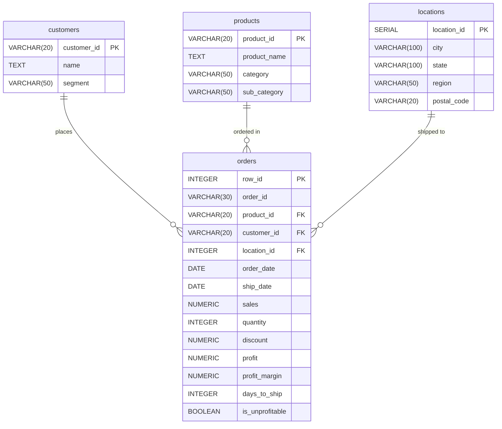
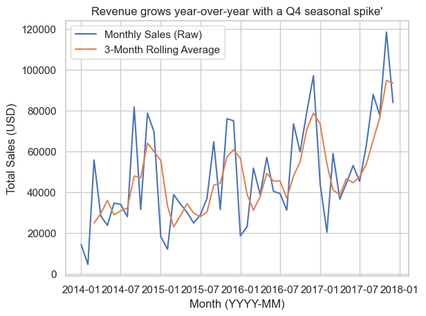
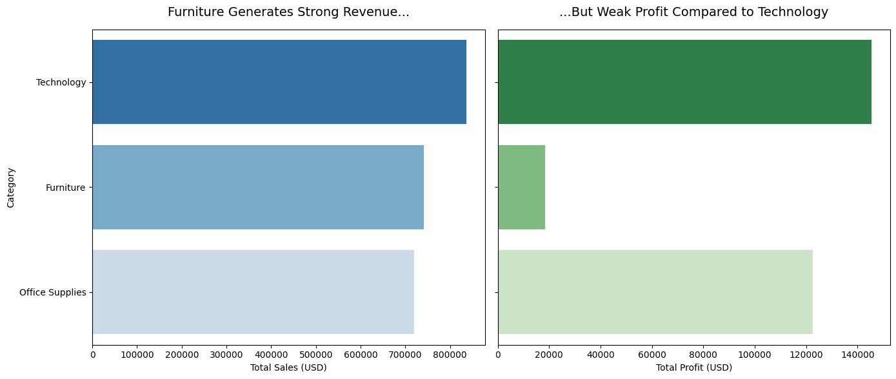
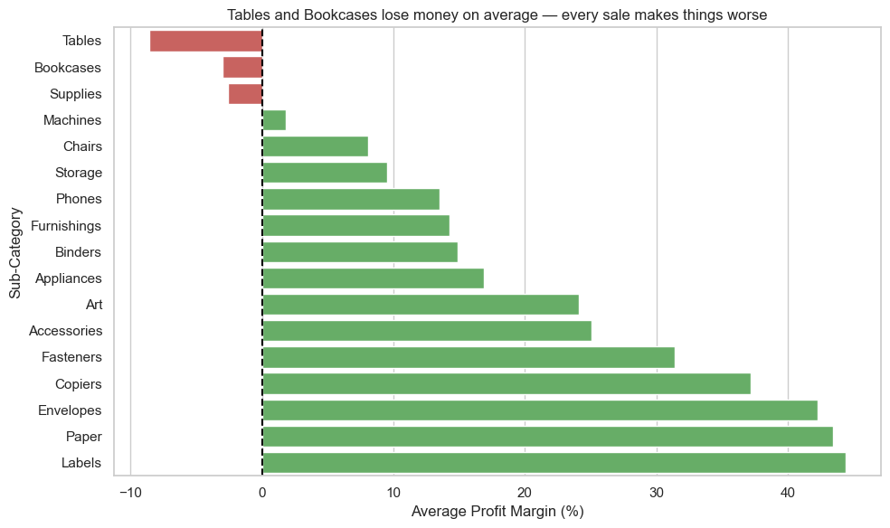
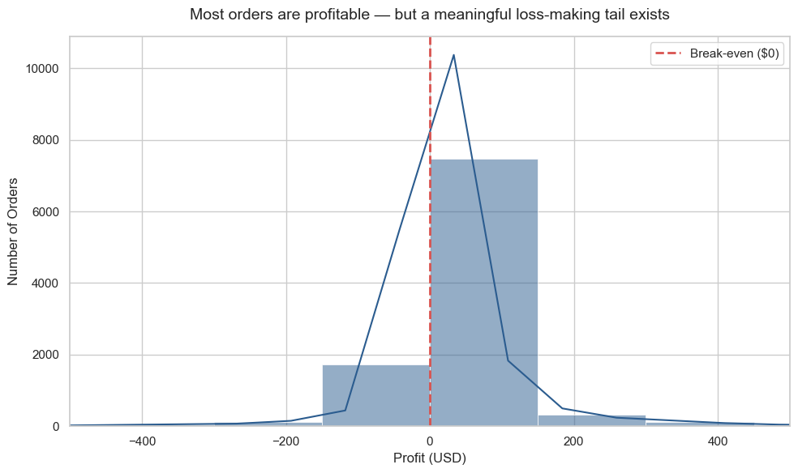
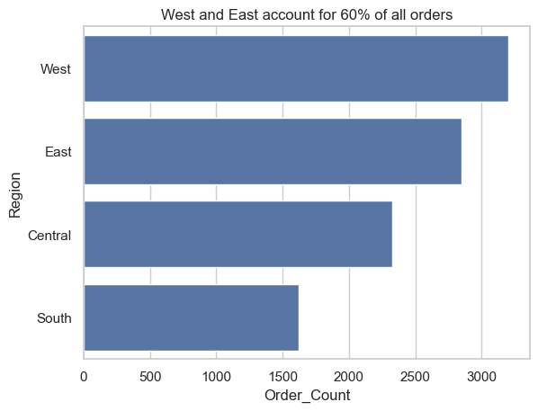

# 🛒 US Superstore Sales Analytics & Database Pipeline
### 📊 End-to-End Data Engineering, PostgreSQL Analytics, and Jupyter Visualization Portfolio

---

## 📋 Table of Contents
1. [Project Overview](#-project-overview)
2. [Data Architecture & Schema (3NF)](#-data-architecture--schema-3nf)
3. [Visual Analytics Highlights](#-visual-analytics-highlights)
4. [Key Business Insights & Analytics](#-key-business-insights--analytics)
   - [Sales & Revenue Trends](#1-sales--revenue-trends)
   - [Customer Segment Profiling](#2-customer-segment-profiling)
   - [Product Portfolio & Profitability](#3-product-portfolio--profitability)
5. [Repository Structure](#-repository-structure)
6. [Local Setup & Environment Execution](#-local-setup--environment-execution)

---

## 🛒 Project Overview

This repository showcases an end-to-end data engineering and analytics pipeline designed to explore, clean, model, and visualize business operations for a major **US Superstore retailer**. 

### The Objective
The core goal of this project is to take a raw, denormalized transactional CSV log (representing **9,994 order lines** over a 4-year range) and transform it into an optimized, highly structured **3rd Normal Form (3NF)** PostgreSQL relational database. Once loaded, advanced analytical SQL queries and Jupyter-based Python visualizations are used to extract key operational insights regarding profitability, regional performance, customer segments, and discount erosion.

### Tech Stack Used
* **ETL & Data Wrangling**: Python 3 (Pandas)
* **Relational Database**: PostgreSQL 16
* **Database Driver & Connectors**: psycopg2, SQLAlchemy
* **Analytical Queries**: PostgreSQL SQL (Window functions, CTEs, Joins, Dense Ranks, String Aggregations)
* **Visualization & Reporting**: Jupyter Notebooks, Matplotlib, Seaborn

---

## 🏛️ Data Architecture & Schema (3NF)

To eliminate redundancy and enforce referential integrity, the raw transactional log was normalized into a structured **3rd Normal Form (3NF)** relational database.

### Physical Entity-Relationship Diagram (ERD)



* **Lookup Tables**: Normalized lookup tables for `customers`, `products`, and `locations` automatically filter redundancies.
* **Core Fact Table**: The `orders` fact table maintains foreign key constraints mapping back to lookup entities, ensuring strict relational integrity.
* **Optimized Types**:
  * Monetary columns (`sales`, `profit`) use exact-precision `NUMERIC` types to avoid floating-point rounding errors.
  * Autoincrement lookup keys utilize `SERIAL` keys.
  * Synthetic columns like `days_to_ship` (Order-to-Ship interval), `profit_margin`, and boolean flag `is_unprofitable` are precalculated during Pandas cleaning to speed up query execution.

---

## 🖼️ Visual Analytics Highlights

Below are the key analytical visualization plots generated by our Jupyter Notebook pipeline (located in the `reports/` directory):

### 1. Monthly Revenue Trend
Tracks sales volumes over time, revealing strong cyclical seasonal peaks in Q4 (specifically November and December sales spikes).


### 2. Category Performance Profiling
Contrasts sales and profits across categories. Highlight: **Technology** yields the highest total profits and margins, whereas **Furniture** incurs high sales but very thin, high-risk profit lines.


### 3. Sub-Category Profit Margins
Ranks sub-categories by profit margin, identifying severe profit-drain products (like **Tables** and **Bookcases**) and top-margin items (like **Paper** and **Labels**).


### 4. Profit Distribution
Analyzes the distribution of individual order line profits, highlighting extreme profit-making sales and significant loss-making orders.


### 5. Orders by Region
Geographic distribution of order placements showing the **West** and **East** regions as dominant hubs.


---

## 📊 Key Business Insights & Analytics

Detailed SQL analysis scripts in `sql/` were executed on the normalized PostgreSQL database. Below are the core findings:

### 1. Sales & Revenue Trends
* **Discount Erosion**: A critical pattern emerged during analysis: applying discounts greater than 20% severely drains profit margins. Orders with a **50%+ discount** consistently generate negative average profit margins (`-1.2` or lower).
* **Unprofitability Rate**: Approximately **18.7% of all order lines** were unprofitable. Enforcing maximum discount limits is the single highest leverage decision to increase overall margins.
* **Regional Dominance**: The **West** region generated the highest overall profits and average profit margins, whereas the **Central** region suffered from high discount rates, lowering its overall average margin.

### 2. Customer Segment Profiling
* **Segment Breakdown**:
  * **Consumer segment**: Represents the largest demographic group (nearly 50% of unique customers and total order volume).
  * **Corporate and Home Office segments**: Deliver higher Average Order Values (AOV) despite smaller overall counts.
* **Single-Order Rate**: Our analysis discovered that only a very tiny fraction of customers placed a single order. Over **90%+ of the customer base are repeat buyers**, highlighting excellent retention metrics.
* **High-Value Contributors**: Analyzed the top 10 most profitable individual customers using window rankings, showing that key high-volume corporate accounts contribute a disproportionate share of the net profit.

### 3. Product Portfolio & Profitability
* **Top Profit Generators**: Copiers, Phones, and Accessories represent the highest-margin items in the inventory.
* **Profit-Destroying Products**: Tables and Bookcases are the largest profit-destroyers, heavily impacted by high shipping costs and aggressive discounting.
* **Discount Consistency**: Identified several products that are discounted on 100% of their orders, suggesting that original list pricing is artificially inflated or represents outdated inventory.

---

## 📂 Repository Structure

The project directory is structured as follows:

```
superstore-analysis/
├── data/
│   ├── raw/                 # Contains the raw transactional CSV log
│   └── processed/           # Sanitized, structured CSV profiles ready for DDL import
├── notebooks/
│   ├── 00_cleaning.ipynb    # Pandas cleaning, datatype alignments, and column synthesis
│   ├── 01_eda.ipynb         # Demographics, geographical summaries, and distributions
│   └── 02_visualization.ipynb # Matplotlib and Seaborn plotting script
├── sql/
│   ├── 01_schema.sql        # Database schema definitions and DDL
│   ├── 02_explore.sql       # Baseline table row counts and date range investigations
│   ├── 03_sales_analysis.sql # Advanced revenue, seasonal, discount, and profitability queries
│   ├── 04_customer_analysis.sql # Customer segment profiling, single-buyers, and rankings
│   └── 05_product_analysis.sql  # Product profitability, margins, and discount consistency queries
├── reports/                 # Saved high-resolution Seaborn plots (.png files)
├── requirements.txt         # Project Python library requirements
├── guide.md                 # Detailed step-by-step mentor workshop guide
└── README.md                # Main portfolio project landing page (this file)
```

---

## 🚀 Local Setup & Environment Execution

Follow these steps to restore and execute the analysis pipeline locally on your machine.

### 1. Navigating and Virtual Environment Initialization
Open your system terminal, clone the repository, and initialize an isolated workspace environment:

```bash
cd superstore-analysis

# Create a virtual environment named 'venv'
python3 -m venv venv

# Activate the workspace environment
source venv/bin/activate
```

### 2. Dependency Installations
Install the scientific, database-driver, and graphing packages listed in the requirements file:

```bash
# Upgrade the pip package manager
pip install --upgrade pip

# Install dependencies
pip install -r requirements.txt
```

### 3. Database Schema Creation (PostgreSQL)
Ensure you have a local PostgreSQL instance running. Open your preferred database GUI client (e.g. pgAdmin or DBeaver) or terminal `psql`, create a database named `superstore_db`, and execute the DDL script:

```bash
# Run schema creations via psql terminal client (or run DDL via DB client GUI)
psql -U postgres -d superstore_db -f sql/01_schema.sql
```

### 4. Running the Analytics Jupyter Notebooks
To open the analysis notebooks, launch Jupyter:

```bash
jupyter notebook
```
Inside the dashboard, navigate to `notebooks/` and run the cells sequentially:
1. `00_cleaning.ipynb` — Cleans raw data and saves sanitized CSV profiles to `data/processed/`.
2. `01_eda.ipynb` — Explores distributions and outputs summary statistics.
3. `02_visualization.ipynb` — Generates and updates plots in the `reports/` folder.
